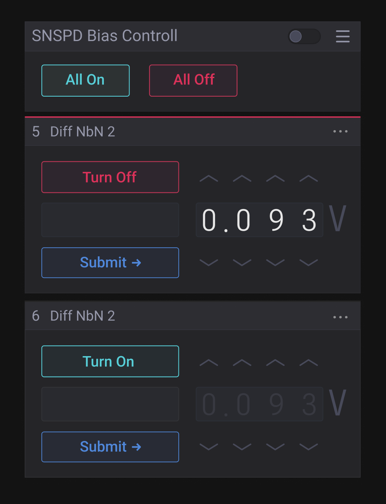

## SNSPD Svelte Bias Controll

**Why use this over SvelteKit?**

- It brings its own routing solution which might not be preferable for some users.
- It is first and foremost a framework that just happens to use Vite under the hood, not a Vite app.

<!--  -->

  

